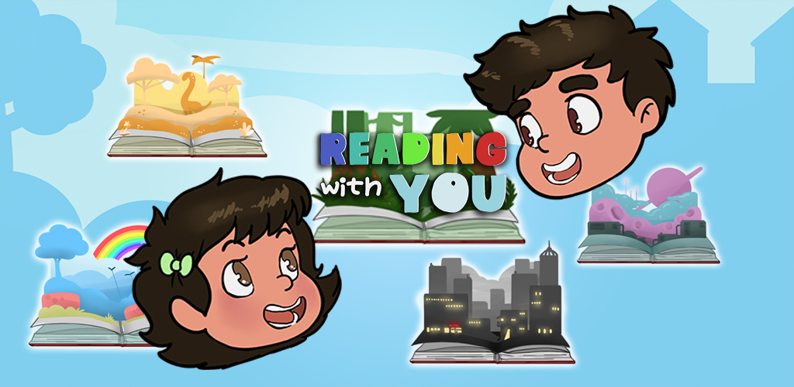
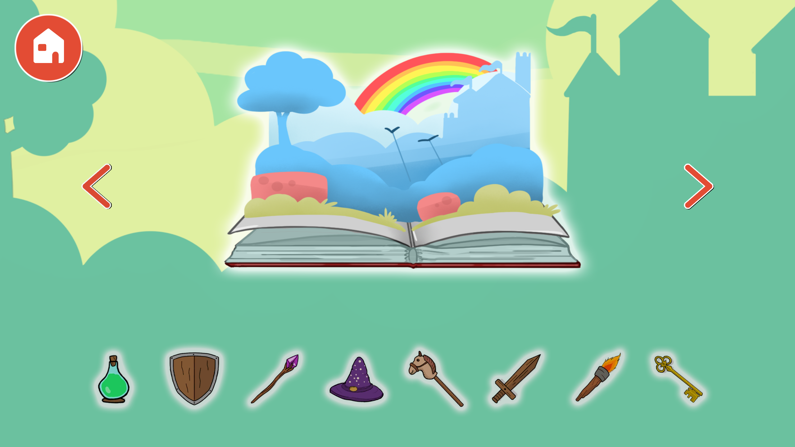
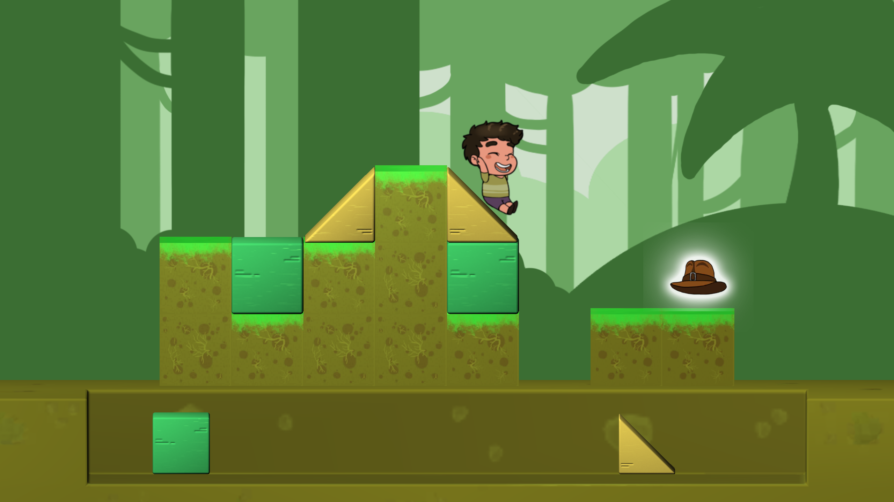

<h1 align="center">📚 Reading With You</h1>

  

  <strong>A mobile path-building puzzle game developed in Unity.</strong> 
  Place geometric blocks, create a safe route, and guide a young reader through five storybook worlds.

  

  
  
  
  
  

## 📌 Project Snapshot

| | |
|---|---|
| **Role** | Gameplay & Systems Programmer |
| **Engine** | Unity 2019.2.0f1 |
| **Language** | C# |
| **Team** | Human Factor — 15 credited members, including 3 programmers |
| **Development** | 2019 academic production |
| **Platform** | Android |
| **Status** | Completed student project; formerly released on Google Play; archived portfolio copy |

## 🎮 Overview

*Reading With You* is a mobile puzzle game built around planning a route before setting a character in motion. The player drags a limited set of geometric blocks from an inventory onto a grid, using platforms, ramps, and trapezoids to bridge gaps and reach the collectible at the end of each level.

The project contains **80 authored levels** across five themed worlds, with Easy and Hard variants. It was developed by a 15-person multidisciplinary student team and was previously released on Google Play through Event Horizon School; the original store listing is no longer available.

My work focused on the player-facing gameplay loop and the systems that connect movement, animation, progression, audio, pooling, level flow, and mobile integration.

## 🕹️ How to Play

Build a valid path first, then start the character and watch the route resolve.

| Input | Action |
|---|---|
| Touch and drag a block | Move a block from the inventory onto the level grid |
| Release a block | Snap it to the grid; invalid placements return to the inventory |
| Tap the player or goal | Start the character once all placed blocks are stable |
| Menu buttons | Select a world, difficulty, and unlocked level |

The character walks automatically. If the path contains a gap or obstruction, the attempt ends and the level resets; reaching the story item unlocks progression.

## 👨‍💻 My Contributions

I worked as one of three programmers in a multidisciplinary team. My documented contributions include:

- Developed and repeatedly refined the **automatic player-movement system**, using forward and downward raycasts to react to platforms, ramps, trapezoids, gaps, obstacles, and the level objective.
- Implemented the player's runtime states for **idle, walking, climbing, sliding, victory, and failure**, including state-dependent speed changes and reset behaviour.
- Integrated world-specific player animation layers, movement animations, particles, collision feedback, and timed sound cues.
- Built the **save and progression flow** for player identity, unlocked Easy and Hard levels, and persisted completion state.
- Integrated the player, level data, UI, and `GameManager` flows for starting attempts, winning, losing, resetting, advancing between levels, and moving between worlds.
- Implemented and polished the game's **audio-management layer**, including background music, character movement, blocks, objectives, and interface feedback.
- Added and integrated reusable **object pooling** for level maps, blocks, and other runtime objects.
- Contributed to block placement and rotation validation, grid behaviour, scene transitions, and final-object feedback.
- Parsed and integrated World 5 content and connected its Easy and Hard levels to the runtime progression flow.
- Contributed to Android configuration and the integration of touch input with the block and gameplay systems.

The repository preserves the original collaborative history and credits. I present the project as team work and do not claim sole authorship of the complete game, its design, or its art.

## ⚙️ Technical Highlights

### Raycast-driven character traversal

`PlayerActions` evaluates the surface ahead and beneath the character as it moves. Collision layers and surface normals determine whether the next state is walking, climbing, sliding, winning, or losing, while animation, speed, particles, and audio follow the same state transitions.

### Physics-aware block placement

Blocks are dragged in screen space, snapped to the construction grid, checked for bounds and overlap, and returned to the inventory when a placement is invalid. Rigidbody constraints and stability checks prevent the player from starting while the route is still moving.

### Data-driven level pipeline

Each level stores its map prefab, player and goal coordinates, available blocks, icon, and unlock state in ScriptableObject data. An editor-side blockout parser converts authored scenes into the assets used by the runtime level loader.

### Progression and reusable content

`GameManager` coordinates five worlds, Easy and Hard level collections, completion flow, unlock state, fades, and persistence. Expandable object pools reuse maps and blocks across the 80-level structure.

## ✨ Project Features

- Drag-and-drop path construction designed for touch screens.
- Automatic character traversal over flat, ascending, and descending surfaces.
- Grid snapping, collision validation, unstable-block checks, and placement recovery.
- 80 levels across five themed storybook worlds.
- Easy and Hard progression tracks with persistent unlock state.
- World-specific character sprites and animation layers.
- Collectible objectives, win/failure feedback, particles, transitions, and audio.
- Data-driven worlds, levels, block inventories, and pooled runtime content.
- Main menu, profile name, world selection, level selection, credits, and privacy-policy flow.

## 🛠️ Technology

- Unity 2019.2.0f1
- C#
- Unity physics and raycasts
- ScriptableObjects
- UGUI and TextMesh Pro
- Animator layers, particles, and Unity audio
- Binary save data using `Application.persistentDataPath`
- Reusable object pools
- Android touch-oriented input

## 🎬 Media

[Gameplay trailer](https://drive.google.com/file/d/1XpM-vQnLTtE56-d5IpU8H-gskp-f862U/view)

  
  

The trailer is currently hosted in the original project archive and will be replaced with a YouTube portfolio link once uploaded.

## 🚀 Running the Project

### Unity project

1. Install Unity **2019.2.0f1** with Android Build Support through Unity Hub.
2. Clone this repository.
3. Open the repository root as a Unity project.
4. Allow Unity to restore the packages recorded in `Packages/manifest.json`.
5. Open `Assets/Scenes/IntegrationTest.unity` and enter Play Mode, or create an Android build from the scene already configured in Build Settings.

The historical Android signing key is intentionally not included. Configure your own keystore before creating a signed release build.

This portfolio migration preserves the original code and asset histories while incorporating the former 2D and 3D submodule repositories directly into a self-contained archive. Generated Unity folders, memory-profiler snapshots, and signing credentials were excluded.

## 🧭 Project Context

- **Context:** Academic multidisciplinary mobile-game production
- **Team:** Human Factor — 4 game designers, 3 programmers, 3 2D artists, and 5 3D artists
- **My position:** Gameplay & Systems Programmer
- **Repository history:** Original code, 2D, and 3D histories preserved; later portfolio-migration changes identified separately
- **Release history:** Previously published on Google Play through Event Horizon School; the store listing is no longer available

## 👥 Credits, Ownership and Status

*Reading With You* was created collaboratively by Human Factor. The complete team is credited in the game. Third-party tools and assets remain the property of their respective authors.

> This repository is shared for portfolio review and archival purposes. It documents my contribution to a collaborative student project and does not grant permission to reuse third-party or team-owned assets. It is not an open-source release.

**Project status:** Completed 2019 student project; preserved for portfolio review and no longer actively maintained.

## 💼 Contact

[LinkedIn — Christopher Bonetto](https://www.linkedin.com/in/christopher-bonetto-547876221)
